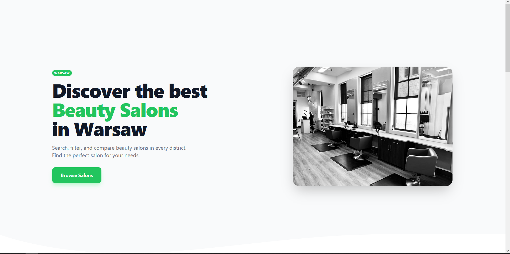
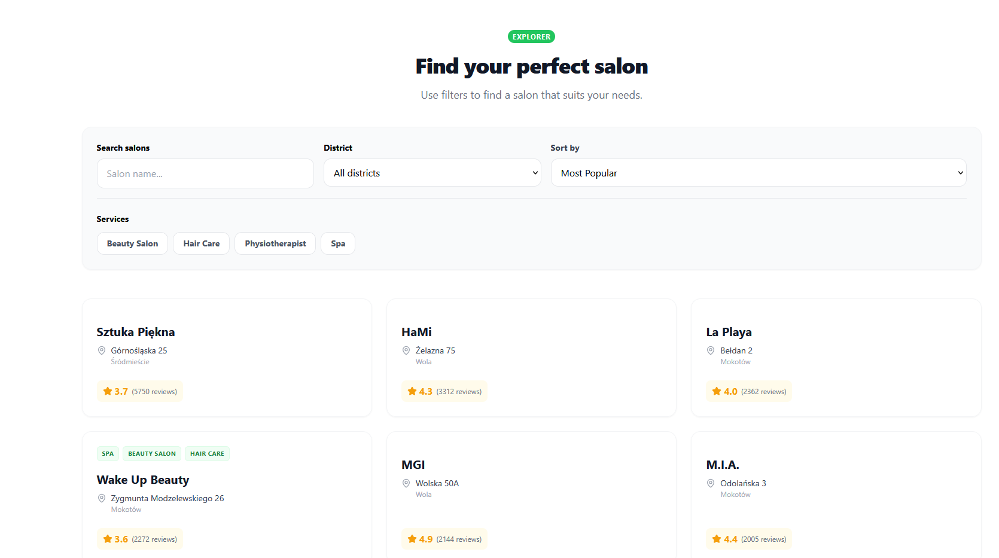
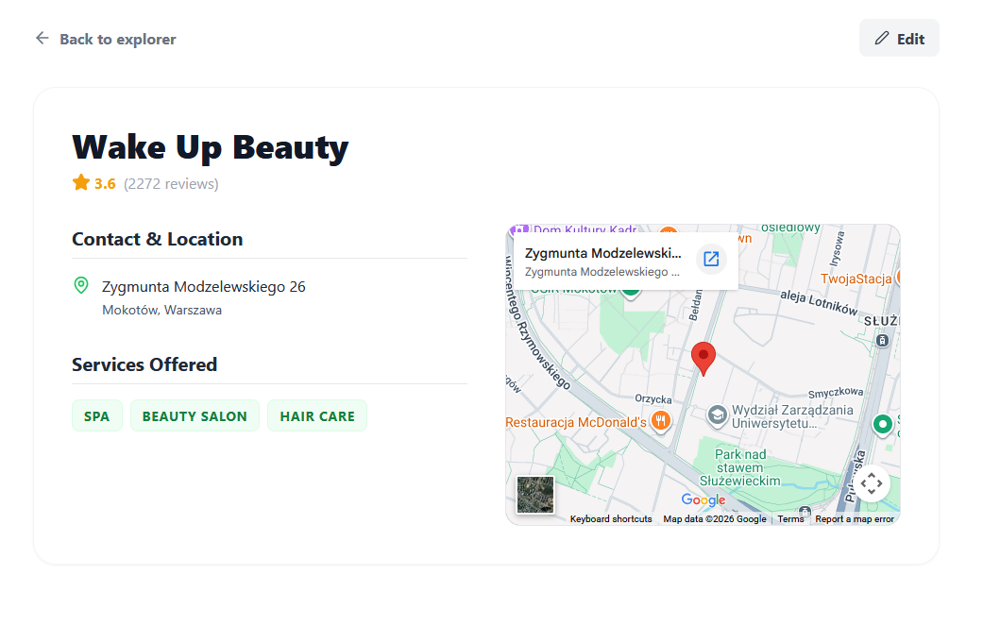

# Warsaw Beauty Salon Explorer

A full-stack application designed to discover, filter, and explore beauty salons across Warsaw.

## Technical Stack

### Backend

* Java 21
* Spring Boot 3.5.14
* Spring Data JPA
* Hibernate
* PostgreSQL

### Frontend

* React (Vite)
* Nginx (production server)

### DevOps / Infrastructure

* Docker
* Docker Compose
* Gradle

---

# How to Run

## Option 1: Full Docker (Recommended)

This approach launches the entire environment (Backend, Frontend, and PostgreSQL) in isolated containers using a single command.

Perfect for a quick start.

### Prerequisites

**Prerequisites:**
* [Docker Desktop](https://www.docker.com/products/docker-desktop/) installed and running.

### Command

```bash
docker compose up --build
```

### Access the application (in web browser)

Frontend:

```text
http://localhost:5173
```

Backend API:

```text
http://localhost:8080
```

---

## Option 2: Hybrid (Local Development)

Use this approach if you prefer running the application locally while keeping PostgreSQL inside Docker.

### Prerequisites

* Docker Desktop
* Java 21 JDK
* Node.js (LTS)


### Step 1 — Start PostgreSQL

```bash
docker compose up postgres
```


### Step 2 — Run the Backend

Navigate to the backend directory:

```bash
cd backend
```

Run the Spring Boot application:

```bash
./gradlew bootRun
```

Backend will be available at:

```text
http://localhost:8080
```

---

### Step 3 — Run the Frontend

Navigate to the frontend directory:

```bash
cd frontend
```

Install dependencies and start the Vite development server:

```bash
npm install
npm run dev
```

Frontend will be available at:

```text
http://localhost:5173
```

---

# Screenshots

| Home | Explorer | Details |
| :---: | :---: | :---: |
|  |  |  |

---

# Application Features

* Browse beauty salons across Warsaw
* Filter salons by category and services
* Responsive frontend UI
* REST API built with Spring Boot
* PostgreSQL database integration
* Dockerized development and production setup

---

# Technical Solution

## Data Persistence

The application uses PostgreSQL managed through Docker volumes, ensuring data persists between container restarts.

## Database Initialization

Automated database setup is handled via initialization scripts mounted into the PostgreSQL container using the `/db` directory. 

This ensures the database schema and seed data are automatically prepared during first startup. 

**Why the seed data?**
The database is pre-seeded with a comprehensive collection of salon data. These records were gathered using the Google Places API. Providing this seed allows you to explore the application immediately without the need for your own API key or incurring any initial usage costs, offering a complete "out-of-the-box" experience.

---

## Frontend / Backend Separation

The architecture cleanly separates frontend and backend services:

* React frontend served independently
* Spring Boot REST API backend
* Nginx used as production web server
* Docker Compose orchestrates the full environment

This setup improves scalability and simplifies deployment.

## Environment Configuration (.env)

The application optionally supports Google services for enhanced salon data updates and location handling.

Supported services:

* Google Geocoding API
* Google Places API

To enable these features, provide your Google API key in the .env file:

```text
GOOGLE_API_KEY=your_google_maps_api_key_here
```

You can obtain an API key from the Google Cloud Console and enable the required APIs for your project.

If no API key is provided, the application will continue to work with the default local data sources.

## Project Structure

```text
warsaw-beauty-salon-explorer/
│
├── backend/          # Spring Boot backend
├── frontend/         # React frontend
├── db/               # Database initialization scripts
├── compose.yaml
```

# Future Improvements

## CI/CD Pipeline

* GitHub Actions for automated testing and deployment
* Docker image publishing
* Automated production rollout


## Authentication & Authorization

* Spring Security integration
* JWT authentication
* User accounts
* Favorite salons
* Reviews and ratings directly on website

## Performance Optimization

* Improved pagination
